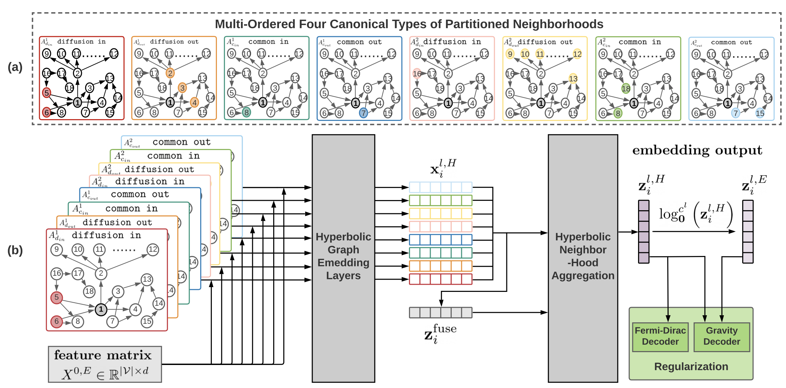

⚡️⚡️⚡️ **Winner** of [CIKM 2022 Best Paper](https://www.cikm2022.org/best-paper)

# D-HYPR: Harnessing Neighborhood Modeling and Asymmetry Preservation for Digraph Representation Learning

This is an official implementation of the CIKM 2022 paper [D-HYPR: Harnessing Neighborhood Modeling and Asymmetry Preservation for Digraph Representation Learning](https://arxiv.org/abs/2112.11734). In this repository, we provide the PyTorch code for training and evaluation as described in the paper. The proposed model **Digraph Hyperbolic Networks** (D-HYPR) considers the unique node neighborhoods in digraphs with multi-scale neighborhood collaboration in hyperbolic space. D-HYPR respects asymmetric relationships of node-pairs, which is guided by sociopsychology-inspired regularizers.      
       
D-HYPR outperforms SOTA on multiple downstream tasks including node classification, link presence prediction, and link property prediction. Particularly, D-HYPR generates meaningful embeddings in very low dimensionalities.       
           
   
If you find our repo useful in your research, please use the following BibTeX entry for citation.    
    
```BibTeX
@article{zhou2022dhypr,
  title={D-HYPR: Harnessing Neighborhood Modeling and Asymmetry Preservation for Digraph Representation Learning},
  author={Zhou, Honglu and Chegu, Advith and Sohn, Samuel S and Fu, Zuohui and De Melo, Gerard and Kapadia, Mubbasir},
  journal={Proceedings of the 31st ACM International Conference on Information and Knowledge Management (CIKM 2022)},
  year={2022}
}
```
<p align="middle">
    
</p>
    
    
# Installation
```shell
conda env create -f environment.yml
```
        
    
# Dataset
Please download the data folder using [this link](https://drive.google.com/file/d/1toPtUrT-Ihirq5nub6WFpNpwVvG2dAow/view?usp=sharing).    
data/    
├── air    
├── blog    
├── citeseer    
├── cora    
├── cora_ml    
├── dblp    
├── survey    
├── wiki    
The folds of each dataset are provided. Each fold is a unique train-test split of the dataset.    
        
# Train and Evaluation    
       
### D-HYPR    
The scripts to run D-HYPR on the 8 datasets for node classification, link presence prediction, and link sign prediction are available in `dhypr/code/D-HYPR`.         
       
#### Link Presence Prediction 
##### The Air Dataset
To get started with a one-time experiment:     
```shell
dhypr/code/dhypr$ conda activate dhypr
dhypr/code/D-HYPR$ ./onefold_lp_air.sh 
```
To obtain the results on all folds with repeated runs (100 runs in total using different seeds):    
```shell
dhypr/code/D-HYPR$ conda activate dhypr
dhypr/code/D-HYPR$ python lp_air.py
```
##### The Cora Dataset
To get started with a one-time experiment:  
```shell
dhypr/code/D-HYPR$ conda activate dhypr
dhypr/code/D-HYPR$ ./onefold_lp_cora.sh 
```
To obtain the results on all folds with multiple runs (100 runs in total using different seeds):    
```shell
dhypr/code/D-HYPR$ conda activate dhypr
dhypr/code/D-HYPR$ python lp_cora.py
```
##### The Blog Dataset
To get started with a one-time experiment:  
```shell
dhypr/code/D-HYPR$ conda activate dhypr
dhypr/code/D-HYPR$ ./onefold_lp_blog.sh 
```
To obtain the results on all folds with multiple runs (100 runs in total using different seeds):
```shell
dhypr/code/D-HYPR$ conda activate dhypr
dhypr/code/D-HYPR$ python lp_blog.py
```
##### The Survey Dataset
To get started with a one-time experiment:  
```shell
dhypr/code/D-HYPR$ conda activate dhypr
dhypr/code/D-HYPR$ ./onefold_lp_survey.sh 
```
To obtain the results on all folds with multiple runs (100 runs in total using different seeds):
```shell
dhypr/code/D-HYPR$ conda activate dhypr
dhypr/code/D-HYPR$ python lp_survey.py
```
##### The DBLP Dataset
To get started with a one-time experiment:  
```shell
dhypr/code/D-HYPR$ conda activate dhypr
dhypr/code/D-HYPR$ ./onefold_lp_dblp.sh 
```
To obtain the results on all folds with multiple runs (100 runs in total using different seeds):
```shell
dhypr/code/D-HYPR$ conda activate dhypr
dhypr/code/D-HYPR$ python lp_dblp.py
``` 
  
#### Node Classification 
##### The Cora-ML Dataset
To get started with a one-time experiment:  
```shell
dhypr/code/D-HYPR$ conda activate dhypr
dhypr/code/D-HYPR$ ./onefold_nc_cora_ml.sh 
```
To obtain the results on all folds:
```shell
dhypr/code/D-HYPR$ conda activate dhypr
dhypr/code/D-HYPR$ python nc_cora_ml.py
```
##### The CiteSeer Dataset
To get started with a one-time experiment:  
```shell
dhypr/code/D-HYPR$ conda activate dhypr
dhypr/code/D-HYPR$ ./onefold_nc_citeseer.sh 
```
To obtain the results on all folds:
```shell
dhypr/code/D-HYPR$ conda activate dhypr
dhypr/code/D-HYPR$ python nc_citeseer.py
```
#### The Wiki Dataset
To get started with a one-time experiment:  
```shell
dhypr/code/D-HYPR$ conda activate dhypr
dhypr/code/D-HYPR$ ./onefold_nc_wiki.sh 
```
To obtain the results on all folds:
```shell
dhypr/code/D-HYPR$ conda activate dhypr
dhypr/code/D-HYPR$ python nc_wiki.py
```
  
#### Semi-Supervised Node Classification with Varied Label Rates
##### The Cora-ML Dataset
To get started with a one-time experiment:  
```shell
dhypr/code/D-HYPR$ conda activate dhypr
dhypr/code/D-HYPR$ ./onefold_vnc_cora_ml.sh 
```
To obtain the results on all folds:
```shell
dhypr/code/D-HYPR$ conda activate dhypr
dhypr/code/D-HYPR$ python vnc_cora_ml.py
```
##### The CiteSeer Dataset
To get started with a one-time experiment:  
```shell
dhypr/code/D-HYPR$ conda activate dhypr
dhypr/code/D-HYPR$ ./onefold_vnc_citeseer.sh 
```
To obtain the results on all folds:
```shell
dhypr/code/D-HYPR$ conda activate dhypr
dhypr/code/D-HYPR$ python vnc_citeseer.py
```
#### The Wiki Dataset
To get started with a one-time experiment:  
```shell
dhypr/code/D-HYPR$ conda activate dhypr
dhypr/code/D-HYPR$ ./onefold_vnc_wiki.sh 
```
To obtain the results on all folds:
```shell
dhypr/code/D-HYPR$ conda activate dhypr
dhypr/code/D-HYPR$ python vnc_wiki.py
```
  
#### Link Sign Classification (SP)
##### The Wiki Dataset
To get started with a one-time experiment:  
```shell
dhypr/code/D-HYPR$ conda activate dhypr
dhypr/code/D-HYPR$ ./onefold_sp_wiki.sh 
```
To obtain the results on all folds:
```shell
dhypr/code/D-HYPR$ conda activate dhypr
dhypr/code/D-HYPR$ python sp_wiki.py
``` 

#### Collecting Results
Please use `dhypr/code/D-HYPR/collect_result_lp.ipynb` to gather the metric result values from the multiple link prediction experiments, and then use `dhypr/helper/get_lp_result_avg_std.ipynb` to get the average metric result values.         

Similarly, `dhypr/code/D-HYPR/collect_result_nc.ipynb` for node classification, `dhypr/code/D-HYPR/collect_result_vnc.ipynb` for semi-supervised node classification, and `dhypr/code/D-HYPR/collect_result_sp.ipynb` for link sign prediction.    

###### Example
The following is an example to demonstrate the entire trainining and evaluation pipeline:    
```shell
dhypr$ cd code/D-HYPR
dhypr/code/D-HYPR$ conda activate dhypr
```
Run D-HYPR on Cora Link Prediction on just fold 0:    
```shell
dhypr/code/D-HYPR$ ./onefold_lp_cora.sh 
```
Run D-HYPR on Cora Link Prediction (100 times):    
1. ```dhypr/code/D-HYPR$ python lp_cora.py``` 
2. Run ```collect_result_lp.ipynb``` 
3. ```cd ../../helper``` 
4. Run ```get_lp_result_avg_std.ipynb``` 

    
### Baselines
The scripts to run the baselines (MLP, HNN, GCN, GAT, HGCN) on the 8 datasets for node classification, link presence prediction, and link sign prediction are available in `dhypr/code/baselines`.     

The baseline code is organized in a similar fashion as D-HYPR, therefore please refer to the above D-HYPR related train/eval instructions to run the baseline code.        

For other baselines such as NERD, ATP and APP, please contact Advith Chegu: ac1771@scarletmail.rutgers.edu      

The code of D-HYPR and the code of baselines are heavily based on the following publically available implementations (we sincerely appreciate the authors of these repositories):    
- https://github.com/HazyResearch/hgcn
- https://github.com/ydzhang-stormstout/HAT
- https://github.com/flyingtango/DiGCN
- https://github.com/deezer/gravity_graph_autoencoders
- https://github.com/matthew-hirn/magnet
- https://github.com/zhenv5/atp
- https://github.com/AnryYang/APP
- https://git.l3s.uni-hannover.de/khosla/nerd

    
        
# K-Order Proximity Matrix
If you are interested to obtain the four types of k-order proximity matrix described in the paper, please refer to the scripts in the `dhypr/preprocessing` folder. Please note that the maximal order `K` (`K_max`) is currently set to 2. The four types of k-order proximity matrix of the 8 datasets were already extracted and provided in the data foler.    
#    


